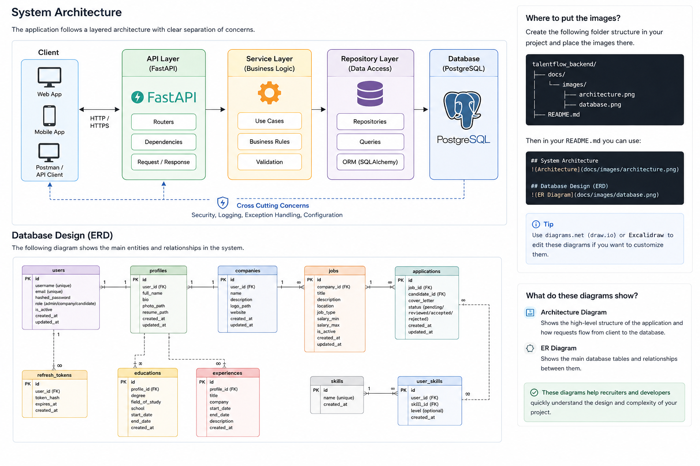

# TalentFlow Backend

A production-style backend API for a modern recruitment and talent management platform.

TalentFlow is a scalable REST API designed to support the core workflows of a recruitment platform, including authentication, company management, candidate profiles, job publishing, and application tracking.

The project follows modern backend development practices with a layered architecture, asynchronous database operations, role-based authorization, and clean separation of concerns.

---

# Key Features

## Authentication & Security

* JWT Authentication
* Access & Refresh Tokens
* Secure Password Hashing (bcrypt)
* Token Rotation
* Role-Based Authorization
* Protected API Endpoints

---

## User Management

* User Registration
* Authentication
* Profile Management
* Account Update
* Account Removal

---

## Company Management

* Company Registration
* Company Profile
* Job Publishing
* Job Management

---

## Candidate Management

* Professional Profile
* Resume Upload
* Profile Photo Upload
* Education Records
* Work Experience
* Technical Skills

---

## Recruitment Workflow

* Publish Jobs
* Browse Available Jobs
* Submit Applications
* Track Application Status
* Review Candidates

---

## Administration

* User Management
* Skill Management
* System Administration

---

# Technology Stack

| Category           | Technology             |
| ------------------ | ---------------------- |
| Language           | Python 3.13            |
| Framework          | FastAPI                |
| ORM                | SQLAlchemy 2.0 (Async) |
| Database           | PostgreSQL             |
| Driver             | AsyncPG                |
| Validation         | Pydantic v2            |
| Authentication     | JWT                    |
| Password Hashing   | Passlib (bcrypt)       |
| Database Migration | Alembic                |
| API Documentation  | Swagger / ReDoc        |
| Containerization   | Docker                 |

---
# Architecture

The application follows a layered architecture that separates business logic from infrastructure and persistence.

## System Architecture



```text
Client
   │
   ▼
API Routers
   │
   ▼
Service Layer
   │
   ▼
Repository Layer
   │
   ▼
Database

## API Layer

Responsible for:

* Request validation
* Dependency injection
* HTTP responses
* Authentication

---

## Service Layer

Responsible for:

* Business rules
* Authorization
* Workflow orchestration
* Data validation

---

## Repository Layer

Responsible for:

* Database access
* CRUD operations
* Query abstraction

---

## Database Layer

* PostgreSQL
* SQLAlchemy 2.0 Async
* Alembic Migrations

---

# Project Structure

```text
talentflow_backend/

├── alembic/
│
├── app/
│   ├── auth/
│   ├── common/
│   ├── core/
│   ├── exceptions/
│   ├── models/
│   ├── repositories/
│   ├── routers/
│   ├── schemas/
│   ├── seeds/
│   ├── services/
│   ├── utils/
│   └── main.py
│
├── uploads/
├── docker-compose.yaml
├── requirements.txt
├── .env.example
└── README.md
```

---

# Core Modules

* Authentication
* Users
* Profiles
* Companies
* Jobs
* Applications
* Skills
* User Skills
* Education
* Experience
* File Management

---

# Security

The API implements multiple security mechanisms including:

* JWT Authentication
* Refresh Token Support
* Password Hashing
* Role-Based Authorization
* Secure Dependency Injection
* ORM-based SQL Injection Protection

---

# Installation

Clone the repository

```bash
git clone https://github.com/your-username/talentflow-backend.git
```

Navigate to the project

```bash
cd talentflow-backend
```

Create a virtual environment

```bash
python -m venv .venv
```

Activate the environment

Windows

```bash
.venv\Scripts\activate
```

Install dependencies

```bash
pip install -r requirements.txt
```

---

# Configuration

Create a `.env` file using `.env.example`.

Example configuration:

```env
APP_NAME=TalentFlow

DATABASE_URL=

SECRET_KEY=

ALGORITHM=HS256

ACCESS_TOKEN_EXPIRE_MINUTES=30

REFRESH_TOKEN_EXPIRE_DAYS=7

UPLOAD_DIR=uploads
```

---

# Database

Start PostgreSQL

```bash
docker compose up -d
```

Run database migrations

```bash
alembic upgrade head
```

Seed initial system data

```bash
python -m app.seeds.seed
```

---

# API Documentation

Swagger UI

```
http://localhost:8000/docs
```

ReDoc

```
http://localhost:8000/redoc
```

---

# Current Capabilities

* JWT Authentication
* Refresh Tokens
* Role-Based Authorization
* Async Database Operations
* Company Management
* Candidate Profiles
* Job Management
* Application Management
* File Upload
* Alembic Database Migrations
* Seed Data
* Layered Architecture
* Repository Pattern
* Service Layer

---

# Roadmap

Planned enhancements include:

* Email Verification
* Password Recovery
* Background Jobs
* Redis Integration
* Notification System
* Full-text Search
* Audit Logging
* Automated Testing
* CI/CD Pipeline
* Cloud Deployment
* Kubernetes Support

---

# Author

**Fatemeh**

Backend Developer

Specialized in Python, FastAPI, PostgreSQL, SQLAlchemy and scalable backend architecture.
